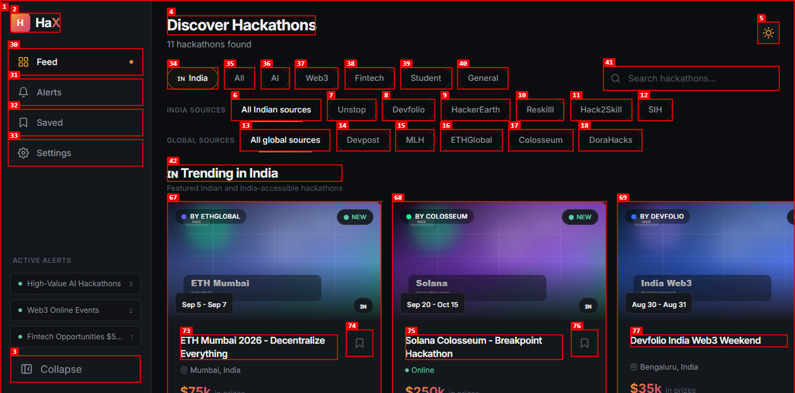
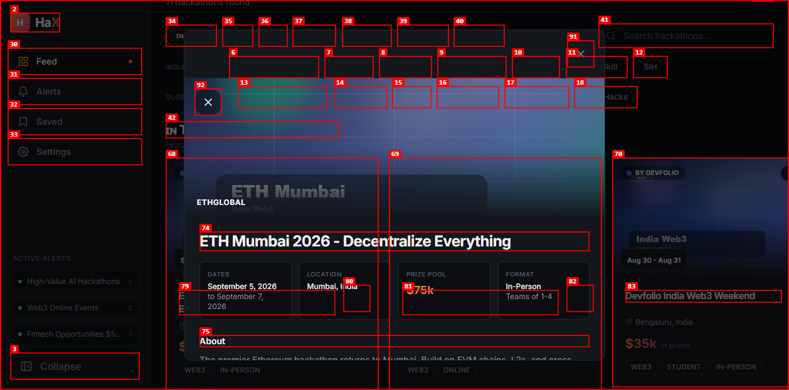
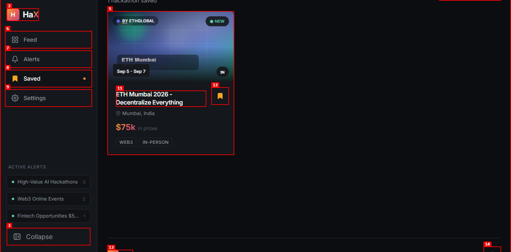
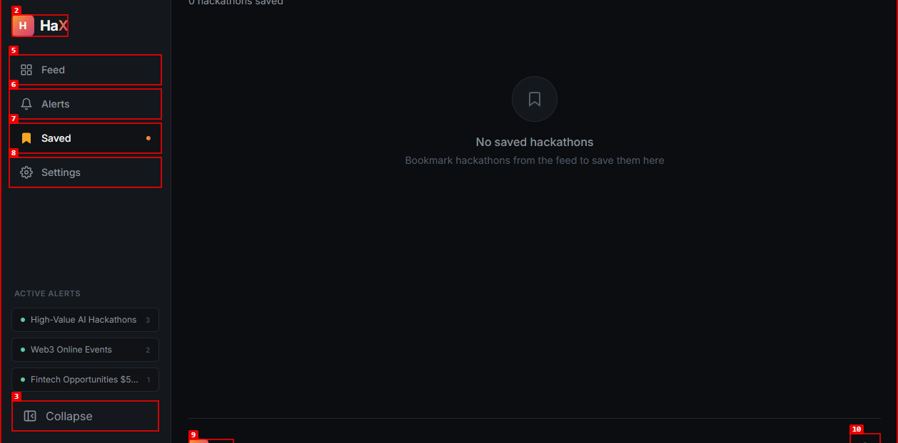
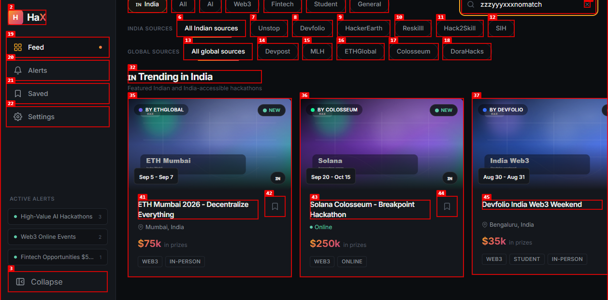
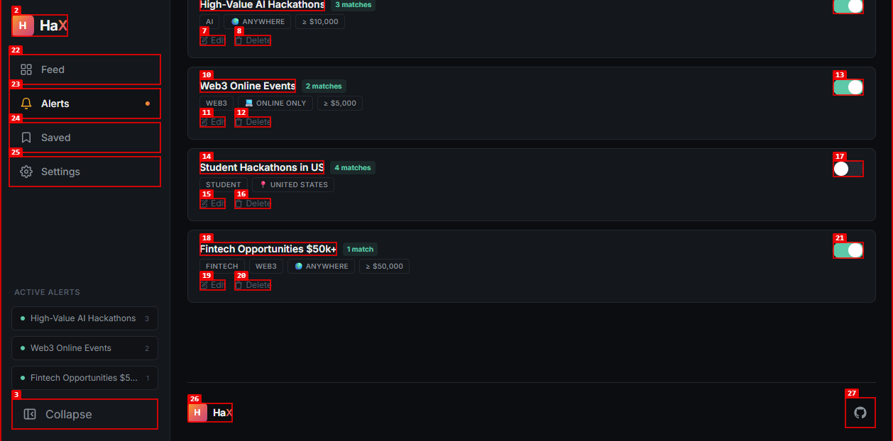
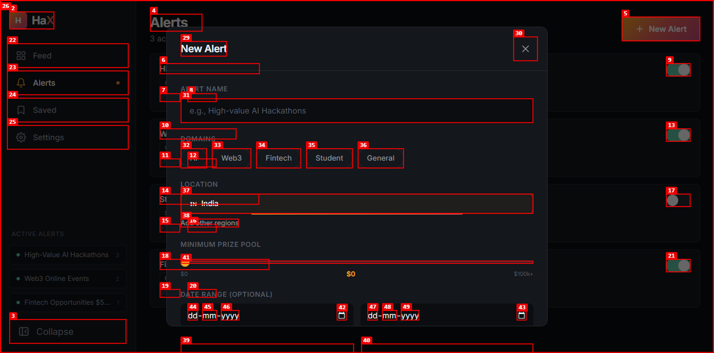
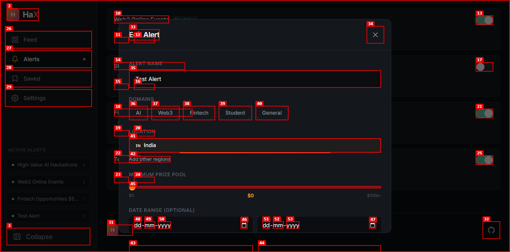
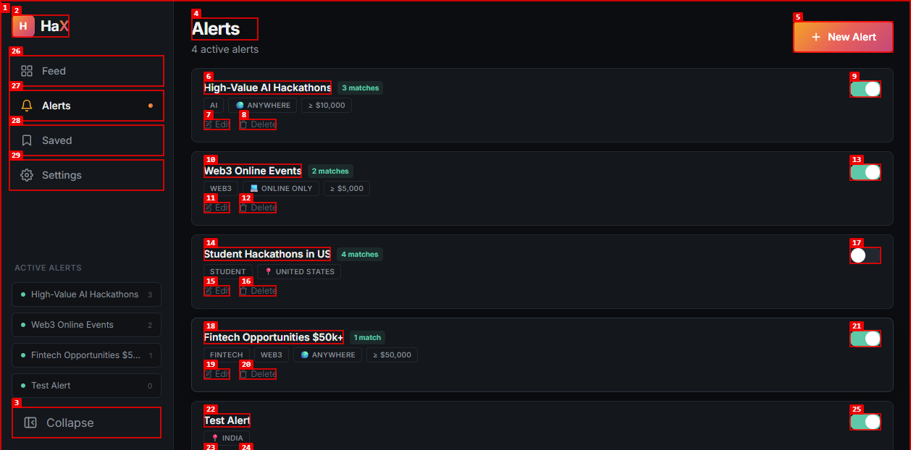
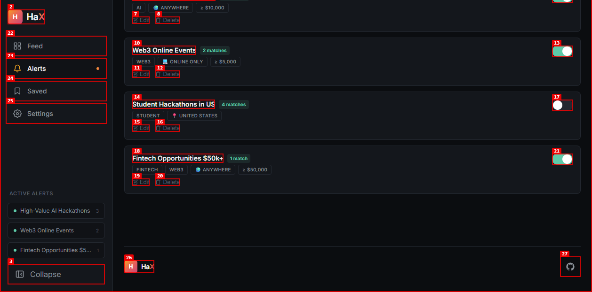

# Dogfood Report: HackAtlas Alpha

| Field | Value |
|-------|-------|
| **Date** | 2026-08-01 |
| **App URL** | https://hackatlas-alpha.vercel.app/ |
| **Session** | hackatlas-alpha |
| **Scope** | Full unauthenticated app pass |

## Summary

| Severity | Count |
|----------|-------|
| Critical | 0 |
| High | 0 |
| Medium | 0 |
| Low | 0 |
| **Total** | **0** |

## Issues

### ISSUE-001: Detail panel icon buttons have no accessible names

| Field | Value |
|-------|-------|
| **Severity** | medium |
| **Category** | accessibility / ux |
| **URL** | https://hackatlas-alpha.vercel.app/ |
| **Repro Video** | N/A |

**Description**

Clicking a hackathon card opens a detail panel with two icon-only buttons. In the accessibility tree both buttons appear only as `button`, with no visible text, `aria-label`, or `title`. Screen reader users cannot tell what these controls do, and sighted keyboard users also get no textual context.

**Repro Steps**

1. Navigate to `https://hackatlas-alpha.vercel.app/`.
   

2. Click any hackathon card, such as `ETH Mumbai 2026 - Decentralize Everything`.
   

3. Observe that the detail panel exposes two unlabeled buttons in the browser accessibility snapshot.

---
### ISSUE-002: Saved empty state has no guidance or recovery action

| Field | Value |
|-------|-------|
| **Severity** | low |
| **Category** | ux / content |
| **URL** | https://hackatlas-alpha.vercel.app/saved |
| **Repro Video** | N/A |

**Description**

After the last saved hackathon is removed, the Saved page shows only the `Saved` heading and footer links. There is no empty-state message, no explanation, and no call to action back to the feed. Users can recover through the sidebar, but the main content area reads as if content failed to load.

**Repro Steps**

1. Save a hackathon from the feed, then open `Saved`.
   

2. Click `Remove bookmark`.
   

3. Observe that the content area has no empty-state copy or action.

---
### ISSUE-003: No-match search still shows unrelated trending cards with no no-results message

| Field | Value |
|-------|-------|
| **Severity** | medium |
| **Category** | functional / ux |
| **URL** | https://hackatlas-alpha.vercel.app/ |
| **Repro Video** | N/A |

**Description**

Entering a search query that matches no hackathons removes the main result list but keeps the `Trending in India` carousel/cards visible. Those visible cards do not match the query, and the page does not show any `No results` message. A user cannot tell whether search failed, only part of the page is being searched, or the visible cards are supposed to be results.

**Repro Steps**

1. Navigate to `https://hackatlas-alpha.vercel.app/`.
   

2. Type `zzzyyyxxxnomatch` into the search box.
   

3. Observe that unrelated trending hackathons remain visible and there is no no-results explanation.

---
### ISSUE-004: Alert modal form controls are unlabeled for assistive technology

| Field | Value |
|-------|-------|
| **Severity** | high |
| **Category** | accessibility |
| **URL** | https://hackatlas-alpha.vercel.app/alerts |
| **Repro Video** | N/A |

**Description**

The New/Edit Alert modal contains multiple controls without accessible labels: the icon-only close button, the prize range slider, and the two date inputs. The browser accessibility tree exposes the close control as an unnamed `button`, the slider only as `slider: 0`, and the date fields as generic Day/Month/Year spinbuttons. The axe audit reports `button-name` and `label` violations with critical impact.

**Repro Steps**

1. Navigate to `Alerts`.
   

2. Click `New Alert` or `Edit`.
   

3. Run an accessibility scan or inspect the accessibility tree. Observe unnamed modal/form controls.
   

---
### ISSUE-005: Muted sidebar and alert action text fails WCAG contrast in dark mode

| Field | Value |
|-------|-------|
| **Severity** | medium |
| **Category** | accessibility / visual |
| **URL** | https://hackatlas-alpha.vercel.app/alerts |
| **Repro Video** | N/A |

**Description**

The axe audit reports multiple `color-contrast` violations in dark mode. Examples include the `Active Alerts` sidebar label and the alert-card `Edit` / `Delete` action text, with contrast around 2.69:1 against the dark background. WCAG AA expects 4.5:1 for normal text, so these controls are harder to read and may be unusable for low-vision users.

**Repro Steps**

1. Navigate to `Alerts` in the default dark theme.
   

2. Inspect the sidebar label and alert card actions, or run an accessibility scan.

3. Observe that muted text and action buttons fail minimum contrast requirements.

---
### ISSUE-006: Alert deletion is immediate with no confirmation or undo

| Field | Value |
|-------|-------|
| **Severity** | medium |
| **Category** | ux / functional |
| **URL** | https://hackatlas-alpha.vercel.app/alerts |
| **Repro Video** | N/A |

**Description**

Clicking `Delete` on an alert removes it immediately. There is no confirmation dialog, no inline confirmation step, and no undo toast. Because alerts are user-created objects, accidental clicks can cause data loss without a recovery path.

**Repro Steps**

1. Create a test alert.
   

2. Click `Delete` on that alert.
   

3. Observe that the alert disappears immediately and no confirmation dialog is open.

---
